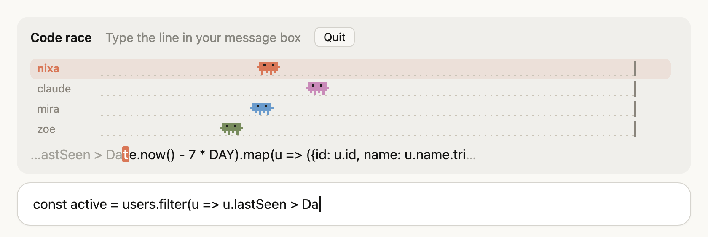
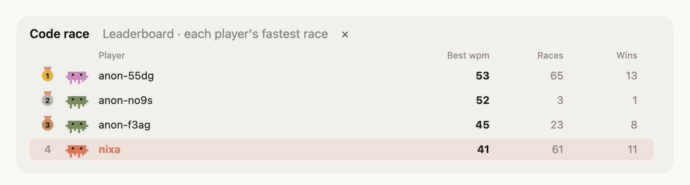

# Code Race for Claude Code

Typing races against other Claude Code users, right above your prompt. Waiting on Claude? Race.



## Play

| Command | |
| --- | --- |
| `/race` | Race whoever is around. The room waits 10 seconds for players, and bots take the seats nobody took, so there is always a race. |
| `/race friend` | Make a room for your friends. It gets a five-letter code. |
| `/race join <code>` | Join a friend's room. |
| `/race top` | Show the leaderboard. |
| `/race nick <name>` | Race under a name. It starts a race too. |

While Claude is thinking, the **Race** button beside the spinner starts a race too.

### A race

- Up to four people race the same line. Half the lines are code (TypeScript, Python, Go, SQL, shell, CSS) and half are short notes in the style of developer docs.
- The line shows above the prompt in a monospace face and opens a little at a time. Type it in your message box. A mistake turns red until you delete it, and Enter sends nothing while a race runs.
- Whatever you had in the message box before the race is put back after it.
- At the end: medals at the finish line, a crown for the winner, your place, words per minute and accuracy, and **Rerace**.
- In the terminal every racer is a small Clawd, Claude Code's mascot, swinging its arms as it runs and raising them at the finish.

### Racing friends

- `/race friend` makes a room and shows its code. **Copy invite** puts `/race join <code>` on your clipboard to send.
- Anyone in the room presses **Start**. There are no bots: only the people in the room race.
- **Rerace** takes everyone into the room's next race, under the same code.

### Leaderboard and names



- `/race top` ranks everyone by their fastest finished race, with how many races they ran and won. Your row is lit, and shown under the top ten when you are not in it.
- A name is one player's. Whoever first races under it keeps it, `/race nick` refuses a name that is taken, and anyone else under it races as `anon-…`.

## Install

Requires Claude Code 2.1.284 or later. The terminal and the desktop app both work.

```
/plugin marketplace add nnixaa/claude-code-race
/plugin install code-race@claude-code-race
```

Then start a new session.

Code race is a mod: a plugin of function hooks, which Claude Code offers as an early-access surface, so a release may change how it looks or behaves.

## What it sends

To the race server: a random player id the plugin makes (with `desktop` or `terminal`, so the two apps are two players), your nickname, and during a race how far along the line you are and how many mistakes you made. A friends' room adds its code. What you type stays on your machine; only the count of matching characters is sent. Nothing from your sessions, prompts, code or account is sent.

The server keeps every race and result (the id, nickname, times, words per minute, accuracy) and who holds each name, for the leaderboard. Other racers see your nickname, never your id.

Without the server the plugin races bots offline.

## Server

`server/` is the backend: a Cloudflare Worker with Durable Objects for the lobby, each race and each friends' room, and D1 for races, results and names. It runs on Cloudflare's free plan, with a daily cap on joins and a smaller one per address (`JOIN_CAP_PER_DAY` in `wrangler.toml`, `PER_ADDRESS_PER_DAY` in `src/index.ts`). How fast the bots type is `BOT_WPM_MIN` and `BOT_WPM_MAX`. To run your own:

```
cd server
npm install
npx wrangler d1 create code-race   # put its id in wrangler.toml
npx wrangler d1 migrations apply code-race --remote
npx wrangler deploy
```

Then point `SERVER` in `plugins/code-race/hooks/register.tsx` at your Worker. For local work, `npm run dev` serves it on port 8787, `npm run smoke` races two scripted players against it, and `node scripts/opponent.mjs [name] [wpm] [minutes] [server]` waits in the lobby and races whoever comes.

## Working on the plugin

`claude --plugin-dir plugins/code-race` loads it from this folder and reloads it on save. `claude plugin validate plugins/code-race` checks it the way Claude Code will. The engine writes the API's TypeScript declarations into `plugins/code-race/.claude-plugin/types` when it loads the plugin (or run `/plugin-types` there), and `tsconfig.json` uses them.

## Limitations

- On the desktop app the Race button shows while Claude is thinking, not while a tool runs, and the other racers move once a second.
- In a very short terminal window the lanes sit right against each other; from about 26 rows there is a gap between them.

## License

[MIT](LICENSE)
